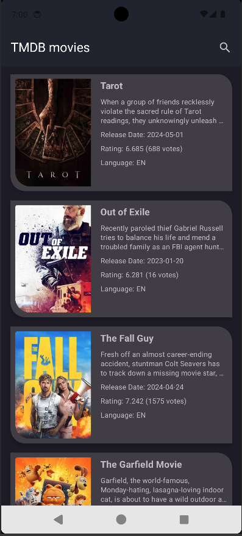
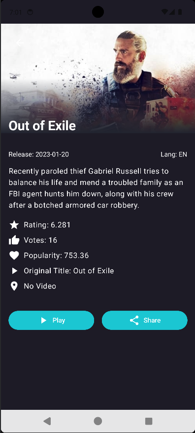

# Paging 3 with Jetpack Compose - TMDB App

A modern Android application showcasing the integration of Jetpack Compose with Paging 3, utilizing The Movie Database (TMDb) API to display a list of movies with infinite scrolling.

<table>
  <tr>
    <td></td>
    <td></td>
  </tr>
</table>

## Technologies Used

This project leverages several cutting-edge Android development technologies:

- **Kotlin**: As the primary programming language
- **Hilt**: For dependency injection
- **Jetpack Compose**: For building the modern UI
- **Navigation Compose**: For in-app navigation
- **Room**: For local database storage
- **Paging 3**: For efficient pagination of data
- **Coroutines**: For managing background tasks
- **Retrofit**: For API communication
- **Gson**: For JSON parsing
- **Coil**: For image loading

## Features

- Fetch and display a paginated list of movies from TMDb API
- Smooth infinite scrolling experience
- Detailed view for each movie
- Local caching for offline access
- Clean and modern UI built with Jetpack Compose

## Architecture

The app follows the MVVM (Model-View-ViewModel) architecture pattern and utilizes the Repository pattern for data management. It demonstrates the implementation of a robust, scalable, and maintainable Android application.

## Getting Started

To run this project, you'll need to:

1. Clone the repository
2. Open the project in Android Studio
3. Obtain an API key from [The Movie Database (TMDb)](https://www.themoviedb.org/documentation/api)
4. Add your API key to the project
5. Build and run the app
